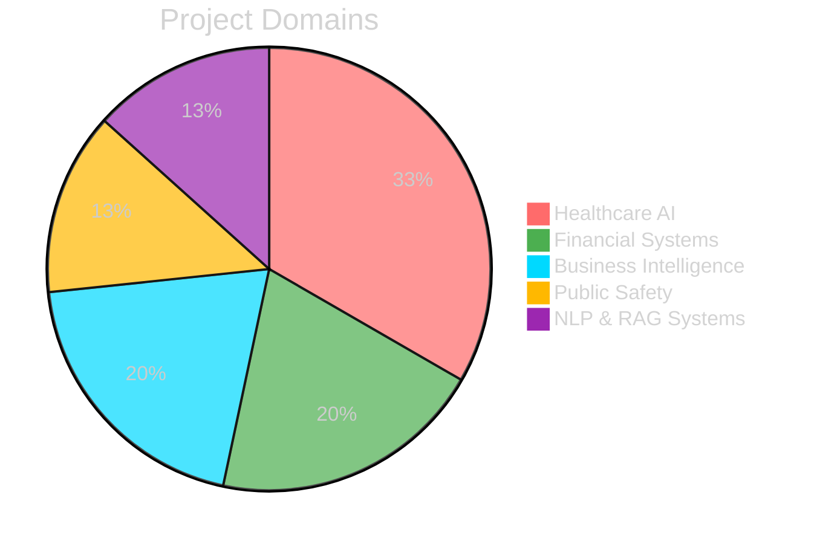
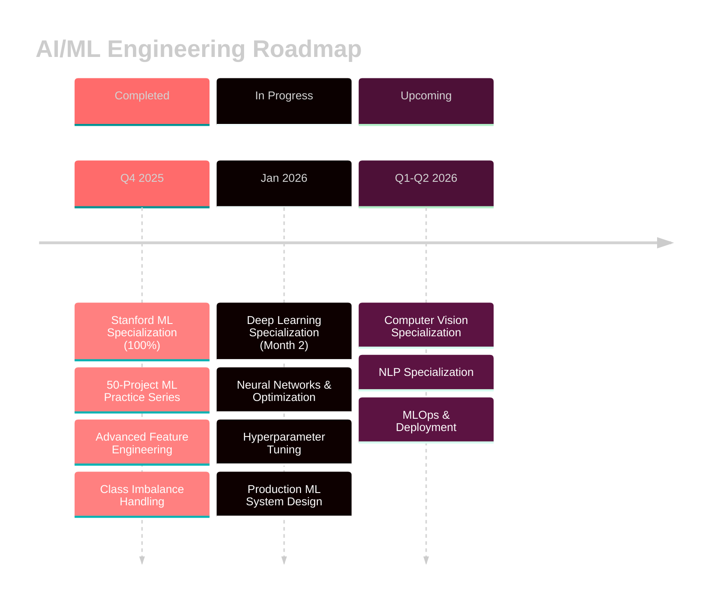

<div align="center">

<!-- Animated Header -->


<!-- Typing SVG -->
<a href="https://git.io/typing-svg"></a>

<br/>

<!-- Badges with Icons -->


<br/><br/>

### 🌱 Learning Mindset


</div>

<br/>

<!-- Matrix Rain Effect -->
<div align="center">
  
</div>

---

##  Current Focus

```python
class Rxkz:
    def __init__(self):
        self.role = "AI/ML Engineering Student"
        self.location = "Auckland, New Zealand 🇳🇿"
        self.education = "Software Engineering @ Yoobee Colleges"
        self.current_learning = [
            "Deep Learning Specialization (Month 2)",
            "Neural Networks & Deep Learning",
            "Advanced ML System Architecture"
        ]
        self.recently_completed = {
            "Stanford ML Specialization": "100% Done ⭐",
            "50-Project ML Practice Series": "Completed ✓"
        }
        self.github_stats = {
            "repositories": 36,
            "focus_areas": ["Healthcare AI", "Financial Systems", "Computer Vision"],
            "commitment": "Building production-ready AI systems"
        }
    
    def learning_approach(self):
        return [
            "📚 Complete coursework",
            "🔍 Clarify concepts through research",
            "🛠️ Build practical projects",
            "✅ Test knowledge with custom assessments",
            "🔄 Iterate and improve"
        ]
    
    def current_mission(self):
        return "Trying to Transform theoretical knowledge into deployable AI solutions"
```

<div align="center">

### 💫 Learning Philosophy

**Build → Debug → Optimize → Deploy → Repeat**

</div>

---

##  Technical Arsenal

<details open>
<summary><b>🤖 Machine Learning & AI</b></summary>
<br/>

<div align="center">

| Skill | Proficiency | Projects |
|-------|-------------|----------|
| **Supervised Learning** |  | 12+ |
| **Deep Learning** |  | 8+ |
| **Reinforcement Learning** |  | 3+ |
| **Computer Vision** |  | 6+ |
| **NLP & RAG Systems** |  | 4+ |

</div>

</details>

<details open>
<summary><b>⚡ Tech Stack</b></summary>
<br/>

<div align="center">

**Languages**


**ML/DL Frameworks**


**Tools & Platforms**


**Specializations**


</div>

</details>

---

<!-- 
##  Featured Projects

<div align="center">

### 🏥 Healthcare AI Systems

</div>

<table>
<tr>
<td width="50%" valign="top">

### 💉 Medical-Dosage-Optimizer-AI
**Deep Q-Network (DQN) Reinforcement Learning**


Intelligent insulin dosage optimization system for diabetes management using sequential decision-making that maximizes time in range.

**Tech:** `Python` `DQN` `OpenAI Gym` `NumPy`

</td>
<td width="50%" valign="top">

### 🩺 Medical-Diagnosis-AI
**Convolutional Neural Networks**


Multi-class disease detection from chest X-rays using custom CNN with weighted loss and healthcare-specific metrics (Recall/ROC-AUC).

**Tech:** `Python` `CNN` `TensorFlow` `Medical Imaging`

</td>
</tr>
</table>

<div align="center">

### 🚨 Public Safety & Security Systems

</div>

<table>
<tr>
<td width="50%" valign="top">

### 🚗 Traffic-Accident-Severity-Predictor-AI
**XGBoost Multiclass Classification**


Predictive emergency dispatch system analyzing accident severity with feature engineering on messy real-world data.

**Tech:** `Python` `XGBoost` `Pandas` `Feature Engineering`

</td>
<td width="50%" valign="top">

### 🛡️ Fraud-Detection-System-AI
**Hybrid Ensemble Learning**


Isolation Forest + Random Forest system handling extreme class imbalance with SMOTE and ensemble methods on IEEE-CIS dataset.

**Tech:** `Python` `Random Forest` `Isolation Forest` `SMOTE`

</td>
</tr>
</table>

<div align="center">

### 💼 Business Intelligence & NLP

</div>

<table>
<tr>
<td width="50%" valign="top">

### 📊 Customer-Segmentation-System-AI
**Unsupervised Learning**


K-means clustering with RFM analysis identifying high-value, at-risk, and new customers from e-commerce transaction data.

**Tech:** `Python` `K-Means` `RFM Analysis` `Matplotlib`

</td>
<td width="50%" valign="top">

### 🤖 AI-Powered Hiring Assistant
**RAG + Dual-AI System**


Full-stack recruitment automation using retrieval-augmented generation with Flask, Supabase, ChromaDB, and Ollama models.

**Tech:** `Python` `Flask` `RAG` `ChromaDB` `Ollama`

</td>
</tr>
</table>

---
-->

##  Project Distribution

<div align="center">



<table>
<tr>
<td width="33%" align="center">

</td>
<td width="33%" align="center">

</td>
<td width="33%" align="center">

</td>
</tr>
<tr>
<td width="33%" align="center">

</td>
<td width="33%" align="center">

</td>
<td width="33%" align="center">

</td>
</tr>
</table>

</div>

---

<!--
##  Learning Journey

<div align="center">



</div>

<table>
<tr>
<td width="33%" valign="top">

### ✅ Completed

 **100% Score**  
 **Series Complete**  
 **Advanced**  
 **Mastered**

</td>
<td width="33%" valign="top">

### 🔄 In Progress (Jan 2026)

 **Month 2**  
 **Active**  
 **Learning**  
 **Design**

</td>
<td width="33%" valign="top">

### 📅 Upcoming

 **Q1 2026**  
 **Q2 2026**  
 **Deployment**  
 **Scale**

</td>
</tr>
</table>

---
-->

##  GitHub Activity

<div align="center">

### 📊 Repository Overview

<table>
<tr>
<td align="center" width="25%">

<br/><br/>
**Total Repositories**
<br/>
Diverse AI/ML projects across multiple domains
</td>
<td align="center" width="25%">

<br/><br/>
**Active Development**
<br/>
Continuously building and improving
</td>
<td align="center" width="25%">

<br/><br/>
**Learning & Building**
<br/>
Coded with AI assistance - still learning
</td>
<td align="center" width="25%">

<br/><br/>
**Well Documented**
<br/>
Clear explanations and examples
</td>
</tr>
</table>

### 💻 Recent Focus Areas


</div>

---

##  Development Philosophy

<div align="center">

### 💡 Core Principles

</div>

```
                      ┌─────────────────────────────────────────────────────────────────┐
                      │                                                                 │
                      │   🎯  BUILD → 🔍 DEBUG → ⚡ OPTIMIZE → 🚀 DEPLOY → 🔄 ITERATE  │
                      │                                                                 │
                      └─────────────────────────────────────────────────────────────────┘
```

<table>
<tr>
<td width="50%" valign="top">

#### 🎯 Real-World Focus

I believe in learning by building real-world applications that solve actual problems. Every project tackles genuine challenges—from healthcare optimization to fraud detection—using production-grade practices.

**Key Practices:**
- ✨ Handle class imbalance in real datasets
- 🔧 Engineer features from messy data
- 📊 Implement appropriate evaluation metrics
- 🏗️ Design scalable architectures

</td>
<td width="50%" valign="top">

#### 🚀 Theory Meets Practice

My approach combines theoretical rigor from Stanford's specializations with hands-on problem-solving, ensuring I don't just understand algorithms but can deploy them effectively.

**Learning Loop:**
- 📚 Master theoretical foundations
- 💻 Implement from scratch
- 🧪 Test on real datasets
- 📈 Optimize for production
- 🔄 Share knowledge

</td>
</tr>
</table>

<div align="center">

> **"The goal is not to predict the future, but to build it."**
> 
> *Currently building the foundation for tomorrow's AI systems*

</div>

---

##  Let's Connect

<div align="center">

I'm actively seeking opportunities to contribute to AI/ML projects and collaborate with other developers passionate about building intelligent systems.

<a href="mailto:rxkz.xv@icloud.com">
  
</a>
<a href="https://github.com/rxkz">
  
</a>
<a href="https://linkedin.com/in/yourprofile">
  
</a>

<br/><br/>

**🌟 Open to:**
- AI/ML Engineering Roles
- Research Collaborations
- Open Source Contributions
- Technical Discussions

<br/>


</div>

---

<div align="center">

### 🎓 Current Status


**Last Updated:** January 2026


</div>
