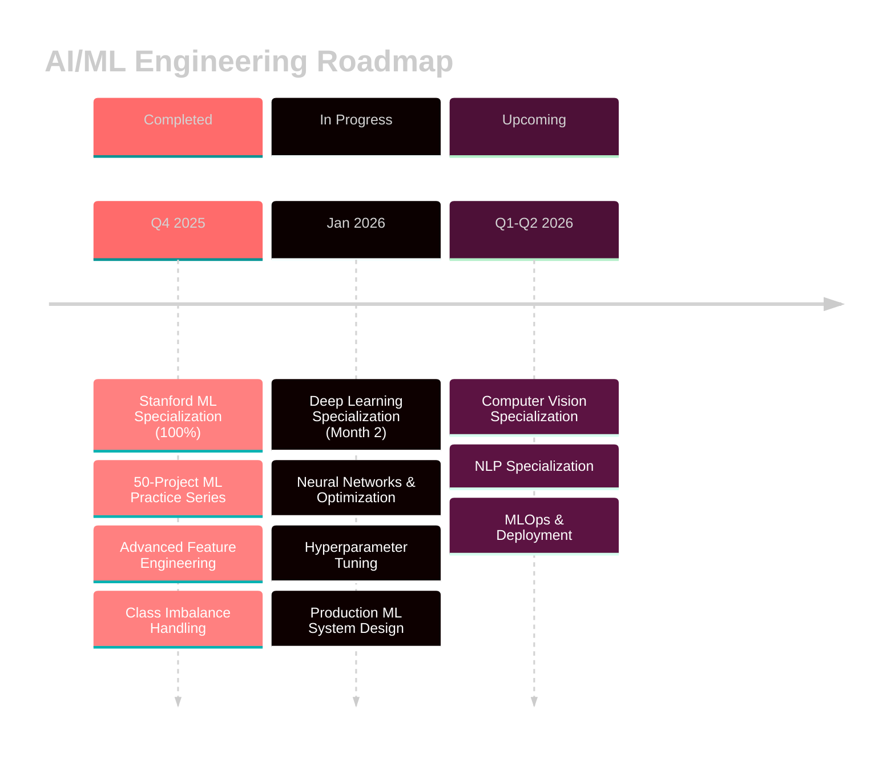

<div align="center">

<!-- Animated Header -->


<br/>

<!-- Learning Mindset Banner with Age -->

</div>

<br/>

---

##  About Me

```python
class Rxkz:
    def __init__(self):
        self.age = 23
        self.role = "AI/ML Engineering Student"
        self.location = "Auckland, New Zealand"
        self.education = "Software Engineering @ Yoobee Colleges (Second Year)"
        self.work = "Part-time room attendant (2 days/week) - maximizing study time"
        
        self.current_learning = [
            "Deep Learning Specialization (Month 2)",
            "Neural Networks & Optimization Algorithms",
            "Advanced ML system design",
            "Model evaluation for real-world constraints"
        ]
        
        self.completed = [
            "Stanford Machine Learning Specialization (100% Score)",
            "50+ ML projects across multiple domains",
            "Healthcare AI, Financial Systems, Computer Vision"
        ]
        
        self.approach = [
            "Study fundamentals thoroughly",
            "Build projects that solve real problems",
            "Debug relentlessly (most of the time I don't know, but I always TRY)",
            "Document and share learnings",
            "Code with AI assistance while understanding the why"
        ]
    
    def mission(self):
        return "Transform ML theory into production-ready systems"
    
    def current_mindset(self):
        return "I know nothing. I'm always learning. And that's the point."
```

---

##  Technical Skills

<div align="center">

**Languages**


**ML/DL Frameworks**


**Tools & Platforms**


**Core Competencies**


</div>

**Machine Learning & AI Expertise:**
- Supervised Learning (Classification, Regression, Ensemble Methods)
- Deep Learning (Neural Networks, CNNs, Optimization)
- Reinforcement Learning (Q-Learning, DQN)
- Computer Vision (Image Classification, Object Detection)
- NLP & RAG Systems (Text Processing, Vector Databases)
- Production Practices (Feature Engineering, Class Imbalance, Model Evaluation)

*I type and code everything myself. AI assists my learning, but every line is written and understood by me.*


---

<!-- 
##  Featured Projects

<div align="center">

### 🏥 Healthcare AI Systems

</div>

<table>
<tr>
<td width="50%" valign="top">

### 💉 Medical-Dosage-Optimizer-AI
**Deep Q-Network (DQN) Reinforcement Learning**


Intelligent insulin dosage optimization system for diabetes management using sequential decision-making that maximizes time in range.

**Tech:** `Python` `DQN` `OpenAI Gym` `NumPy`

</td>
<td width="50%" valign="top">

### 🩺 Medical-Diagnosis-AI
**Convolutional Neural Networks**


Multi-class disease detection from chest X-rays using custom CNN with weighted loss and healthcare-specific metrics (Recall/ROC-AUC).

**Tech:** `Python` `CNN` `TensorFlow` `Medical Imaging`

</td>
</tr>
</table>

<div align="center">

### 🚨 Public Safety & Security Systems

</div>

<table>
<tr>
<td width="50%" valign="top">

### 🚗 Traffic-Accident-Severity-Predictor-AI
**XGBoost Multiclass Classification**


Predictive emergency dispatch system analyzing accident severity with feature engineering on messy real-world data.

**Tech:** `Python` `XGBoost` `Pandas` `Feature Engineering`

</td>
<td width="50%" valign="top">

### 🛡️ Fraud-Detection-System-AI
**Hybrid Ensemble Learning**


Isolation Forest + Random Forest system handling extreme class imbalance with SMOTE and ensemble methods on IEEE-CIS dataset.

**Tech:** `Python` `Random Forest` `Isolation Forest` `SMOTE`

</td>
</tr>
</table>

<div align="center">

### 💼 Business Intelligence & NLP

</div>

<table>
<tr>
<td width="50%" valign="top">

### 📊 Customer-Segmentation-System-AI
**Unsupervised Learning**


K-means clustering with RFM analysis identifying high-value, at-risk, and new customers from e-commerce transaction data.

**Tech:** `Python` `K-Means` `RFM Analysis` `Matplotlib`

</td>
<td width="50%" valign="top">

### 🤖 AI-Powered Hiring Assistant
**RAG + Dual-AI System**


Full-stack recruitment automation using retrieval-augmented generation with Flask, Supabase, ChromaDB, and Ollama models.

**Tech:** `Python` `Flask` `RAG` `ChromaDB` `Ollama`

</td>
</tr>
</table>

---
-->

##  Project Portfolio

**36 repositories** across multiple AI/ML domains:
- **Healthcare AI:** 5 projects (Medical dosage optimization, Disease diagnosis from X-rays)
- **Financial Systems:** 3 projects (Fraud detection, Risk analysis)
- **Business Intelligence:** 3 projects (Customer segmentation, RFM analysis)
- **Public Safety:** 2 projects (Traffic accident severity prediction)
- **NLP & RAG Systems:** 2 projects (AI-powered hiring assistant, Document processing)

<!-- Featured projects section commented out until repositories are public
Full project details will be added when university work is publicly available
-->

---

<!--
##  Learning Journey

<div align="center">



</div>

<table>
<tr>
<td width="33%" valign="top">

### ✅ Completed

 **100% Score**  
 **Series Complete**  
 **Advanced**  
 **Mastered**

</td>
<td width="33%" valign="top">

### 🔄 In Progress (Jan 2026)

 **Month 2**  
 **Active**  
 **Learning**  
 **Design**

</td>
<td width="33%" valign="top">

### 📅 Upcoming

 **Q1 2026**  
 **Q2 2026**  
 **Deployment**  
 **Scale**

</td>
</tr>
</table>

---
-->

##  Why This Matters

I'm not building projects to fill a portfolio — I'm trying to  solve problems I find interesting while learning how ML systems actually work. Every project tackles real challenges: imbalanced datasets, messy data, evaluation metrics that matter in production, and systems that need to scale.

**My approach combines:**
- Theoretical foundations from structured learning ( specializations, Done)
- Hands-on problem-solving with real datasets and production constraints
- Honest iteration and debugging (I don't pretend to know what I'm still learning Most of the time I still dont know anything but i always TRY )
- Building with AI assistance while understanding the "why" behind every decision

I'm 23, still learning, and actively seeking opportunities to contribute to AI/ML teams where I can keep growing.

---

##  Connect

<div align="center">

I'm actively seeking opportunities to contribute to AI/ML teams where I can keep growing.

<br/>

<a href="mailto:rxkz.xv@icloud.com">
  
</a>
<a href="https://github.com/rxkz">
  
</a>
<a href="https://linkedin.com/in/yourprofile">
  
</a>

<br/><br/>

**Open to:** AI/ML Engineering Roles • Research Collaborations • Open Source Contributions • Technical Mentorship

<br/>


</div>

---

<div align="center">

**Last Updated:** January 2026 | **Repositories:** 36 | **Status:** Always learning

<br/>


</div>
